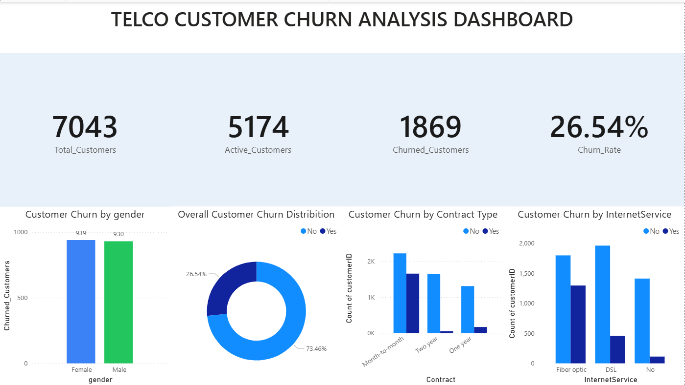

# Customer Retention & Churn Analysis – Task 2

This repository contains the Customer Retention & Churn Analysis project created using Power BI
as part of the **Future Interns – Data Science & Analytics Internship (Task 2)**.

## 📌 Project Overview
The objective of this project is to analyze customer churn patterns using the Telco Customer dataset
and identify key factors influencing customer retention through an interactive dashboard.

## 📊 Dashboard Highlights
- Total Customers, Active Customers, Churned Customers, and Churn Rate KPIs
- Overall Customer Churn Distribution
- Customer Churn by Gender
- Customer Churn by Contract Type
- Customer Churn by Internet Service

## 🔍 Key Insights
- Customers on **month-to-month contracts** have a significantly higher churn rate.
- **Fiber optic internet users** show higher churn compared to DSL and no-internet users.
- Churn is **nearly equal across genders**, indicating gender is not a major churn driver.
- Long-term contracts (one-year and two-year) contribute to **better customer retention**.
- Customers without long-term commitments are more likely to churn.

## 🛠 Tools Used
- Power BI
- Telco Customer Churn Dataset

## 📂 Repository Contents
- Power BI Dashboard file (.pbix)
- Project documentation
## 📸 Dashboard Preview

## 👩‍💻 Created By
Aysha  
Future Interns – Data Science & Analytics
